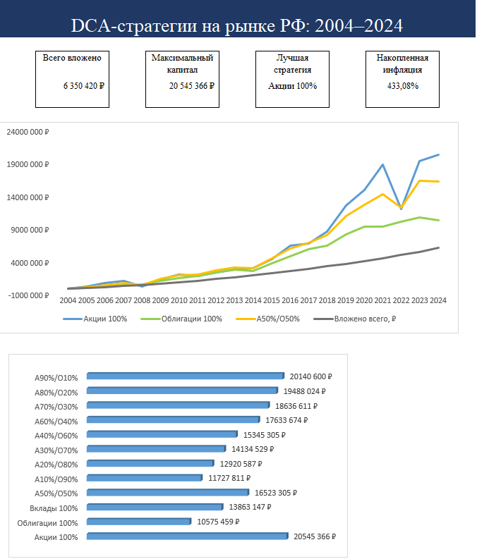
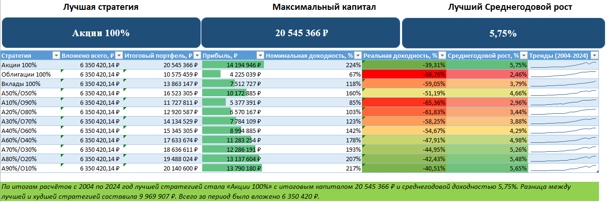
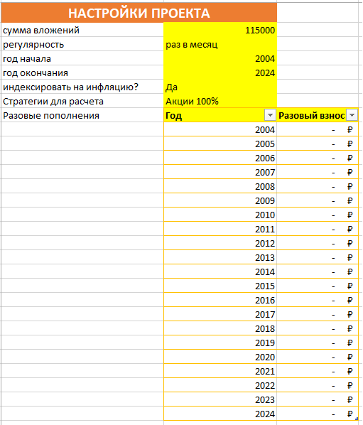
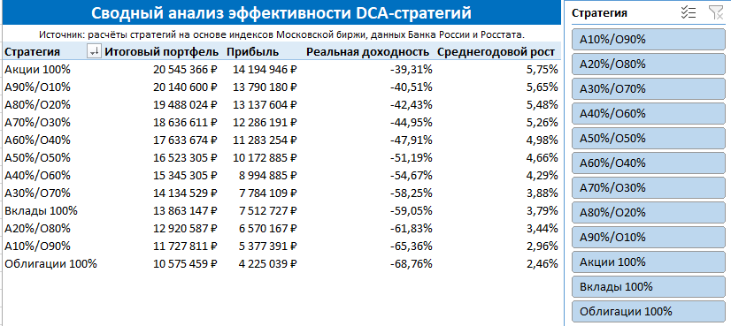
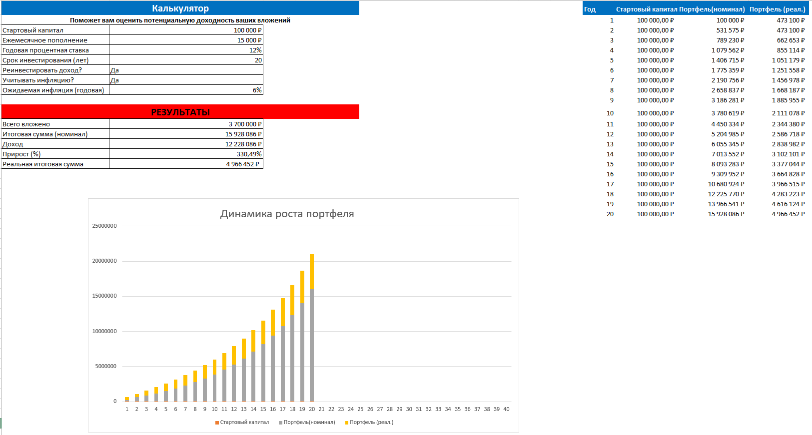

# DCA-стратегии на российском рынке 2004–2024

## Описание проекта

**Аналитический проект: сравнение DCA-стратегий на российском рынке на основе данных за 2004–2024 гг. с возможностью выбора периода расчёта.**

Проект реализован в Microsoft Excel и предназначен для сравнения различных инвестиционных стратегий при регулярном инвестировании по методу DCA (Dollar Cost Averaging).

В модели сравниваются стратегии с разной структурой портфеля:

- акции 100%
- облигации 100%
- вклады 100%
- смешанные портфели акции/облигации в пропорциях от 10/90 до 90/10

---

## Цель проекта

Оценить, как разные стратегии регулярного инвестирования показали бы себя на российском рынке за период 2004–2024 гг. с учётом:

- доходности акций
- доходности облигаций
- доходности вкладов
- инфляции
- индексации взносов
- разовых пополнений
- выбора периода расчёта

---

## Используемые инструменты

Проект выполнен в Microsoft Excel.

В работе использованы:

- умные таблицы
- ВПР
- ЕСЛИ / ЕСЛИОШИБКА
- проверка данных
- условное форматирование
- сводные таблицы
- срезы
- спарклайны
- графики и дашборды

---

## Источники данных

- MOEX MCFTR - индекс полной доходности акций Московской биржи
- MOEX RGBITR - индекс полной доходности государственных облигаций
- Банк России - ключевая ставка
- Росстат - инфляция / индекс потребительских цен

Ссылки на источники также приведены внутри Excel-файла на листе `Источники`.

---

## Основные возможности модели

- выбор года начала и окончания расчёта
- настройка суммы регулярных вложений
- индексация взносов на инфляцию
- добавление разовых пополнений
- сравнение стратегий по итоговому капиталу
- расчёт номинальной и реальной доходности
- расчёт среднегодового роста
- интерактивный калькулятор
- сводный анализ со срезом
- дашборд с ключевыми показателями

---

## Скриншоты

### Дашборд

### Итоги

### Настройки

### Сводный анализ

### Калькулятор

---

## Ключевые выводы

По итогам базового сценария лучшей стратегией стала стратегия с высокой долей акций.  
При этом результаты сильно зависят от выбранного периода расчёта, уровня инфляции и структуры портфеля.

Проект показывает, что высокая номинальная доходность не всегда означает высокую реальную доходность после учёта инфляции.

---

## Ограничения модели

Модель является аналитическим Excel-проектом и не является инвестиционной рекомендацией.

В расчётах не учитываются:

- налоги
- комиссии брокера
- спреды
- ограничения ликвидности
- индивидуальные особенности инвестора

---

## Файл проекта

Excel-файл доступен в репозитории:

`dca-strategies-moex-analysis.xlsx`
